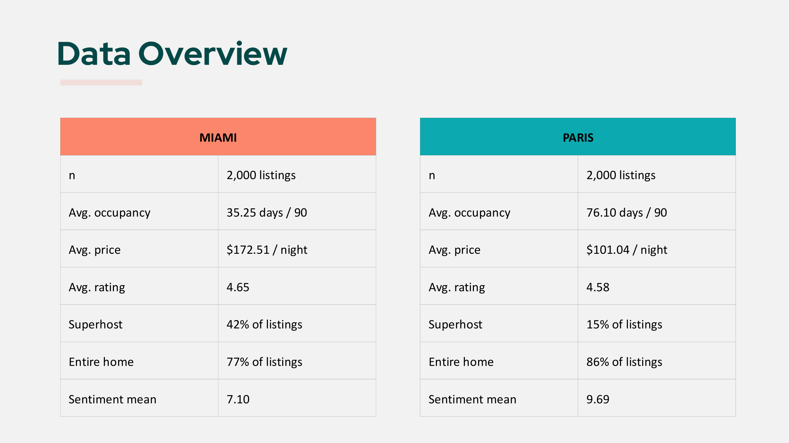
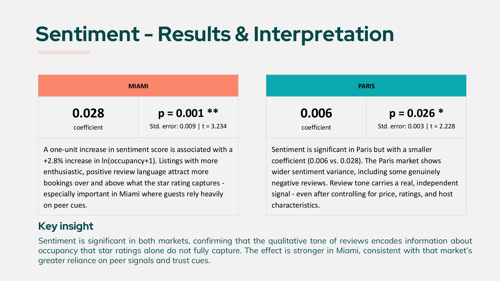
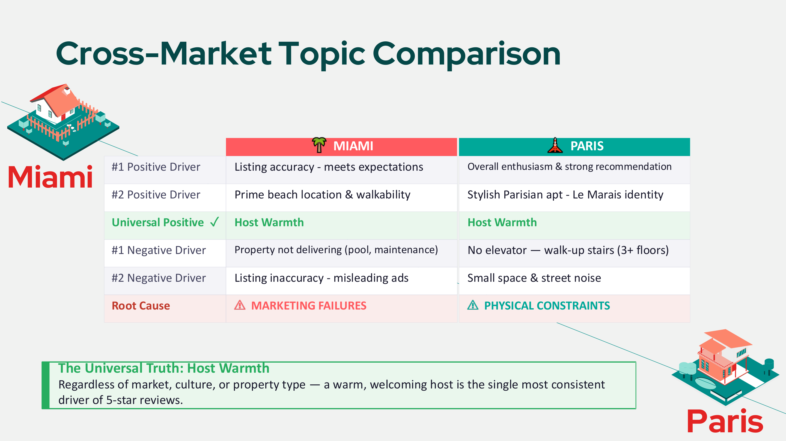
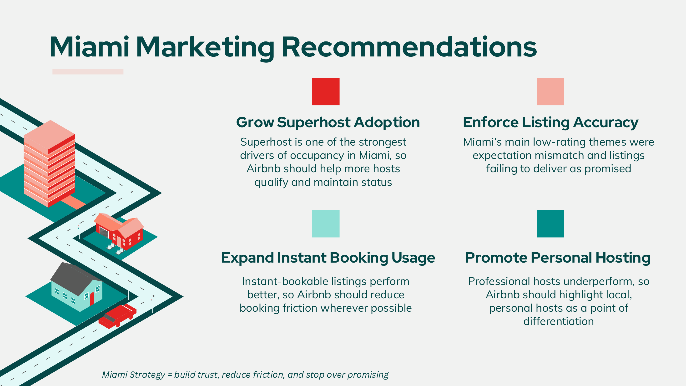
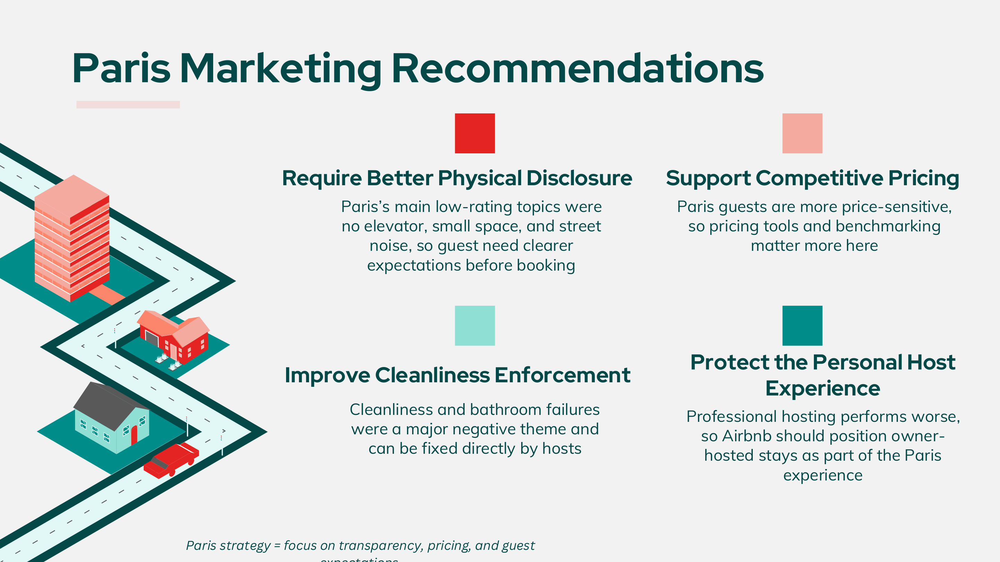

# Airbnb — Text Analytics & Occupancy Drivers (Miami vs Paris)

Compared two Airbnb markets using:
1) linear regression on listing attributes + sentiment to explain occupancy, and  
2) topic modeling on review text to identify themes linked to higher vs lower ratings.

## Highlights
- Modeled occupancy using log-transformed predictors and binary host/listing features; sentiment added signal beyond star ratings.
- Topic modeling compared review themes across markets and linked topics to rating differences (5-star vs 3-star).
- Delivered market-specific recommendations (Miami: trust + friction reduction; Paris: transparency + pricing sensitivity).

## Visuals
### Data Overview

### Sentiment & Regression Insight

### Cross-market Topic Comparison

### Recommendations

## Repo Structure
- `code/` — R scripts (Miami + Paris)
- `report/` — submitted deck/report (PDF)
- `assets/` — visuals embedded above

> Raw datasets and case materials are excluded due to licensing/data-sharing restrictions.
